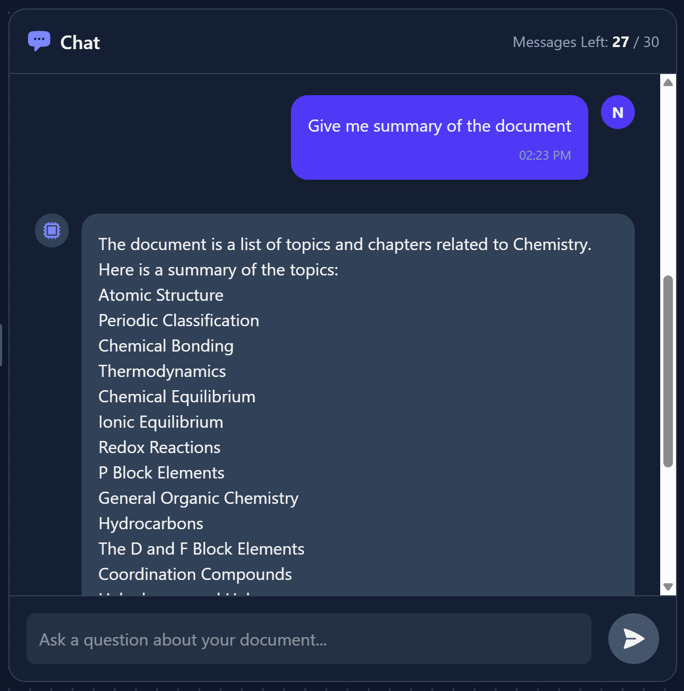
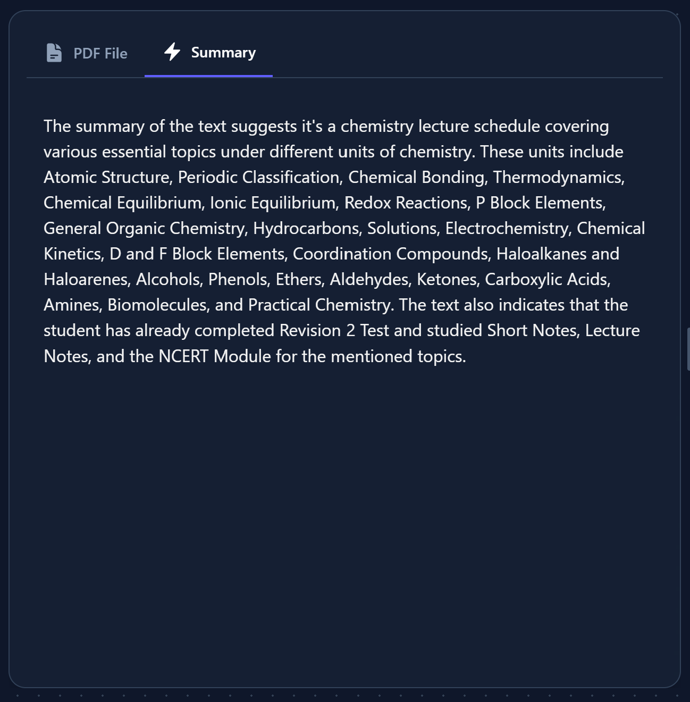

# MistBriefAI - AI-Powered PDF Chat & Summarizer

[](https://opensource.org/licenses/MIT)
[](https://github.com/TDSxJONEY/AI_PDF_CHAT/actions)
[](https://github.com/TDSxJONEY/AI_PDF_CHAT/commits/main)
[](https://mistbriefai.vercel.app/)
[](https://mistbriefai-backend.onrender.com)

> **An AI-powered web application to instantly summarize and chat with your PDF documents.**

---

## 🌟 Overview

This section provides a comprehensive look at your project. It should be compelling enough to make someone want to use or contribute to your work.

* **What's the problem?** Reading through lengthy PDF documents to find specific information or get a general summary is tedious and time-consuming.
* **How does this project solve it?** MistBriefAI allows users to upload a PDF, generate an AI-powered summary instantly, and interact with the document's content via a smart chat interface.
* **Who is this for?** This tool is designed for students, researchers, professionals, and anyone who needs to quickly digest and extract information from dense documents.
* **Why this project?** It provides a seamless, all-in-one experience with a side-by-side, resizable workspace to view the PDF and the AI interaction simultaneously. Documents are stored securely using Cloudinary, and the entire stack is built on modern, efficient technologies.

---

## 📸 Screenshots & Demo

A picture is worth a thousand words. Include a link to a live demo and add screenshots to showcase your project's interface and functionality.

**[➡️ Live Demo Link](https://mistbriefai.vercel.app/)**

*PDF Chat Interface*


*AI Summary View*


---

## ✨ Key Features

List the primary features of your application. Be descriptive and focus on the benefits to the user.

* **AI-Powered Summaries:** Instantly generate concise summaries of PDF documents up to 20MB.
* **Smart Chat Interface:** Interact with and ask questions about your PDF content.
* **Secure Document Handling:** Upload and store documents securely using Cloudinary.
* **Side-by-Side View:** View your PDF and the AI-generated content in a resizable workspace.
* **Secure Authentication:** JWT-based authentication to protect user data.
* **Responsive Design:** A clean, modern UI that works seamlessly on all devices.

---

## 🛠️ Tech Stack & Architecture

This project is a full-stack application built with a modern MERN-like stack (MongoDB, Express, React, Node.js), but with some key additions for its specific functionality. The architecture is designed for efficiency, scalability, and a great developer experience.

### Frontend 🎨

The frontend is a dynamic **Single-Page Application (SPA)** built to provide a fast and interactive user experience.

* **React (with Vite):** The core of our user interface is built with **React**, a powerful JavaScript library for creating component-based UIs. We use **Vite** as our build tool and development server, which offers a significantly faster development experience and optimized production builds compared to traditional bundlers.
* **Tailwind CSS:** Instead of writing traditional CSS, we use **Tailwind CSS**, a utility-first framework. This allows us to build complex, responsive layouts directly within our HTML (JSX) by composing utility classes. It helps maintain a consistent design system and speeds up development time.
* **Axios & React-PDF:** To communicate with our backend, we use **Axios**, a promise-based HTTP client that simplifies making API requests. For the core feature of displaying documents, **React-PDF** is used to render PDF files seamlessly within the browser, directly inside our React components.

---

### Backend ⚙️

Our backend is a robust RESTful API that handles business logic, data persistence, and security. It also intelligently delegates specialized tasks to a Python script.

* **Node.js & Express.js:** The server is built on **Node.js**, a JavaScript runtime that allows us to use JavaScript on the backend. We use **Express.js**, a minimal and flexible web framework, to handle routing, API endpoints, and middleware management.
* **MongoDB & Mongoose:** For our database, we chose **MongoDB**, a NoSQL document-oriented database known for its flexibility and scalability. We interact with it via **Mongoose**, an Object Data Modeling (ODM) library that provides a straightforward, schema-based solution for modeling our application data, enforcing validation, and managing business logic.
* **JSON Web Tokens (JWT):** Authentication is handled using **JWT**. When a user logs in, the server generates a secure, signed token. This token is then sent by the frontend with every subsequent request to access protected API routes, ensuring a stateless and secure authentication system.
* **Python (PyMuPDF) Integration:** For the heavy lifting of parsing PDFs, we leverage the power of Python. A dedicated Python script using the **PyMuPDF** library handles text extraction. When a user uploads a PDF, our Node.js server invokes this script (likely via a `child_process`), passing it the file. The Python script extracts the text and returns it to the Node.js server. This polyglot approach allows us to use the best tool for each specific job.

## 🚀 Deployment & DevOps

Our deployment is automated via a modern CI/CD pipeline, using a decoupled hosting strategy to optimize each part of the application for performance and scalability.

* **🌐 Vercel (Frontend):** The React SPA is deployed to **Vercel**, which leverages a **Global Edge Network** to ensure minimal latency for users worldwide. Deployments are automatically triggered from our Git repository.

* **⚙️ Render (Backend):** The Node.js API and its associated Python script are hosted on **Render** as a flexible **Web Service**. This allows us to manage our backend environment, scale resources as needed, and handle secrets securely.

* **🤖 GitHub Actions (CI/CD):** **GitHub Actions** orchestrates our pipeline. On every push to the `main` branch, it automatically runs tests and quality checks. Upon success, it triggers the production deployments on Vercel and Render, ensuring only validated code reaches users.

---

## 🚀 Getting Started

Follow these instructions to get a copy of the project up and running on your local machine for development and testing purposes.

### Prerequisites

* **Node.js:** Make sure you have Node.js (v18.x or newer) installed.
* **Python:** Make sure you have Python and `pip` installed.
* **Package Manager:** `npm` or `yarn`.
* **Database:** A running instance of MongoDB (either locally or via a service like MongoDB Atlas).

### Installation & Setup

1.  **Clone the repository:**
    ```sh
    git clone [https://github.com/TDSxJONEY/AI_PDF_CHAT.git](https://github.com/TDSxJONEY/AI_PDF_CHAT.git)
    ```
2.  **Navigate into the project directory:**
    ```sh
    cd AI_PDF_CHAT
    ```
3.  **Install Backend Dependencies:**
    ```sh
    cd backend
    npm install
    pip install -r requirements.txt
    ```
4.  **Install Frontend Dependencies:**
    ```sh
    cd ../frontend
    npm install
    ```
5.  **Configure Environment Variables:**
    * Create a `.env` file in the `backend` directory.
        ```env
        # backend/.env
        MONGO_URI=your_mongodb_connection_string
        JWT_SECRET=your_super_secret_jwt_key
        CLOUDINARY_CLOUD_NAME=your_cloudinary_cloud_name
        CLOUDINARY_API_KEY=your_cloudinary_api_key
        CLOUDINARY_API_SECRET=your_cloudinary_api_secret
        CLIENT_URL=http://localhost:5173
        ```
    * Create a `.env.development` file in the `frontend` directory.
        ```env
        # frontend/.env.development
        VITE_API_URL=http://localhost:8000
        ```
6.  **Run the application:**
    * **Run Backend** (from the `backend` folder):
        ```sh
        node index.js
        ```
    * **Run Frontend** (from the `frontend` folder):
        ```sh
        npm run dev
        ```
    The backend will run on `http://localhost:8000` and the frontend on `http://localhost:5173`.

---

## 🗺️ Roadmap

Here are some of the features and improvements planned for future releases.

* **Feature A:** Implement chat history for registered users.
* **Feature B:** Add support for other document types (e.g., .docx, .txt).
* **Improvement:** Refactor the text extraction model for complex layouts.

---

## 🤝 How to Contribute

Contributions are welcome and greatly appreciated! If you have an idea for an improvement, please fork the repository and create a pull request.

1.  Fork the Project
2.  Create your Feature Branch (`git checkout -b feature/NewAmazingFeature`)
3.  Commit your Changes (`git commit -m 'Add some NewAmazingFeature'`)
4.  Push to the Branch (`git push origin feature/NewAmazingFeature`)
5.  Open a Pull Request

Please make sure to update tests as appropriate.

---

## 📜 License

This project is licensed under the MIT License. See the `LICENSE` file for more details.

---

## 🙏 Acknowledgements

A special thanks to these resources and individuals for their inspiration and guidance.

* [Readme.so](https://readme.so/) for the README inspiration.
* [Shields.io](https://shields.io/) for the cool badges.

---

## 📧 Contact

Joney – [GitHub Profile](https://github.com/TDSxJONEY)

Project Link: [https://github.com/TDSxJONEY/AI_PDF_CHAT](https://github.com/TDSxJONEY/AI_PDF_CHAT)